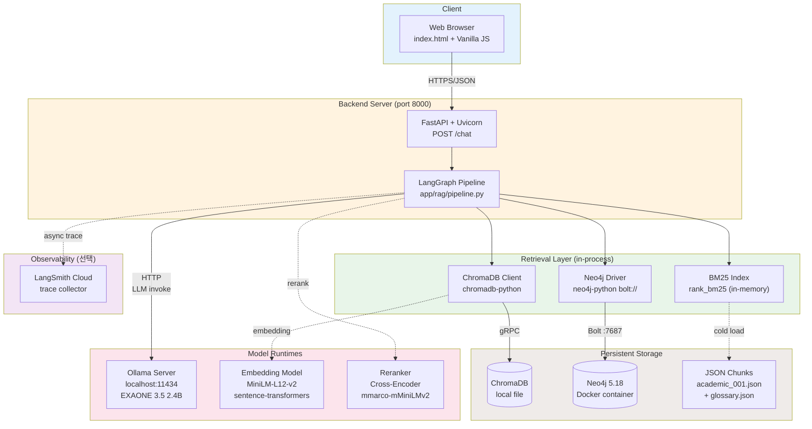
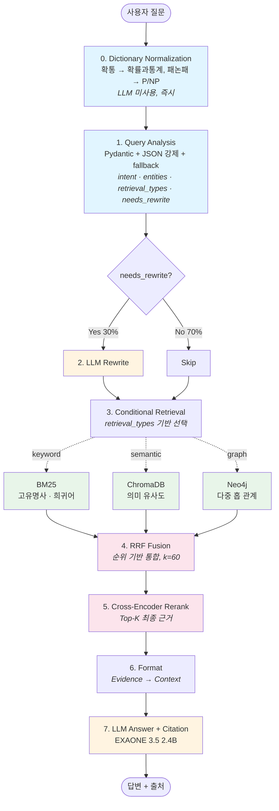

# YU AI Chatbot — Hybrid GraphRAG for University Q&A

용인대학교 학사정보 검색을 위한 **KPI-First Hybrid GraphRAG** 챗봇.
학생 구어체·약어를 정규화한 뒤, 질문 특성에 따라 **BM25 · ChromaDB · Neo4j** 를 조건부 조합하고, RRF Fusion 과 Cross-Encoder Reranking 을 거쳐 **출처 기반 답변**을 제공한다.

**Live**: https://chatbot.yongin.ac.kr/
**상세 실험 · KPI 프레임워크**: [`docs/EXPERIMENT.md`](docs/EXPERIMENT.md)

---

## 핵심 결과 (실측 N=1,000 × 2 datasets, Colab T4 GPU · 2026-08-05)

| 지표 | Vector Only (Before) | Hybrid Pipeline (After) | 개선 |
|---|:---:|:---:|:---:|
| **교수명 검색 정확도** | Recall@10 **4.9%** | Hit@5 **65~68%** | **약 13배** |
| **JSON Parsing 안정성** | — | **99.3%** | ✅ 목표 95% 초과 |
| **Pipeline Error Rate** | — | **0.1%** | ✅ 목표 <1% |
| **평균 응답 시간** | — | **3.6s** | ✅ 목표 <5s |
| **P95 응답 시간** | — | **6.3s** | ✅ 목표 <8s |
| **LLM 호출/질문** | — | **2.29** (Rewrite 조건부) | ✅ 목표 ≤3 |
| **Rewrite 회피율** | — | **70%** | 조건부 라우팅 효과 |

**Relationship Query 견고성 검증 (N=10 pilot, Neo4j 활성/비활성 비교):** 두 조건 모두 100% 정확도 — 조건부 라우팅이 Neo4j 부재 시 우아한 fallback 동작 실증. (대규모 관계 평가셋 확장은 후속)

---

## 4가지 핵심 설계 역량

기술 스택 나열이 아니라, 이 프로젝트가 실증한 4가지 엔지니어링 판단.

### 1. 문서 구조화 (Document Structuring)

- **문제**: PDF를 그대로 청킹하면 표 · 목록 · 계층 구조가 파괴되어, RAG 품질의 upstream 결정 요인이 무너짐.
- **역할**: PDF → Markdown 변환으로 계층 유지, section path 를 chunk metadata 로 보존, type 별(course · professor · info · dept_phone) 분리 청킹.
- **성과**: 1,054 raw chunks + 315 structured chunks 병행 인덱싱. Section path 보존으로 chunk 맥락 손실 최소화.

### 2. 검색기 역할 분리 (Retriever Separation)

- **문제**: 단일 검색기로는 고유명사 · 의미 · 관계라는 서로 다른 사각지대를 커버 불가. 초기 Vector 단독 시 교수명 Recall@10 **4.9%** — 시스템 최대 병목.
- **역할**: BM25(exact match) · ChromaDB(semantic) · Neo4j(graph) 각각 고유 사각지대만 담당하도록 명확한 경계 설정. 검색기 결과는 Evidence 공통 스키마로 통일.
- **성과**: 교수명 **Hit@5 65~68%** (약 13배 개선). 검색기별 사용률 실측으로 역할 분리 실증 — BM25 74%, semantic 49%, graph 5.7%.

### 3. 조건부 라우팅 (Conditional Routing)

- **문제**: "다 넣어" 안티패턴 — 모든 검색기 · 모든 LLM 호출을 무조건 수행하면 latency · 비용 · failure surface 증가.
- **역할**: Query Analysis (Pydantic + JSON 강제)가 `retrieval_types` · `needs_rewrite` 를 판단 → 파이프라인이 조건부 호출. LLM 부담 최소화.
- **성과**: Rewrite 회피율 **70%**, 질문당 LLM 호출 **2.29회** (목표 3회 이하). 평균 응답 **3.6초** (목표 5초 이하 달성).

### 4. 비교 실험과 검증 (Comparative Validation)

- **문제**: "썼다" 가 아니라 "효과 있었다" 를 증명해야 함. 설계 근거 없이 기술을 나열하면 신뢰도 하락.
- **역할**: **KPI-First 프레임워크** (4 카테고리 22개 지표) · 각 컴포넌트에 "왜 넣었나 · 검증 KPI · 실패 신호" 사전 정의 · N=1,000 × 2 datasets 실측.
- **성과**: JSON 성공률 **99.3%**, Pipeline Error Rate **0.1%**, 관계형 견고성 실증 (Neo4j 활성/비활성 100%). 실측 근거 데이터 공개 — `data/eval/*.json`.

---

## 시스템 아키텍처

컴포넌트 구성 · 배포 · 통신 프로토콜.



**배포 특성:**
- **모든 컴포넌트 로컬 실행** — 외부 API 의존성 없음 (LangSmith 트레이싱만 선택적 클라우드)
- **Neo4j 만 별도 컨테이너** (docker-compose) — 나머지는 Python 프로세스 내부
- **Ollama · 임베딩 · Reranker 는 별도 프로세스/모델 캐시** — 파이프라인은 HTTP · Python API 로 호출
- **JSON chunks 는 cold load** (BM25 인덱스는 in-memory, Chroma DB는 pre-indexed local file)

**장애 격리:**
- Neo4j 부재 시 → `_get_driver()` 자동 감지 후 검색기 없이 우아하게 fallback (§4.2 실증)
- Ollama 미실행 시 → LLM 노드 예외 catch 후 pipeline_error 로 기록
- ChromaDB 파손 시 → BM25 만으로도 대부분 질문 응답 가능 (§4.1)

---

## 파이프라인 흐름

질문이 처리되는 알고리즘 단계.



**설계 원칙:** 저비용·확정성 우선 (Dict → Rule → LLM), 필요한 검색기만 조건부 호출.

---

## 왜 이 3가지 조합인가

각 검색기는 서로 다른 사각지대를 커버한다.

| 검색기 | 강한 사각지대 | 대표 질문 |
|---|---|---|
| **BM25** | 고유명사 · 희귀어 exact match | "김중헌 교수" |
| **ChromaDB (Vector)** | 표현 다양성 · 의미 유사도 | "학교 쉬려면 어떻게 해?" |
| **Neo4j (Graph)** | 다중 홉 엔티티 관계 | "김중헌 교수 화요일 수업" |

**핵심:** 항상 3개 다 실행하지 않는다. Query Analysis 가 뽑은 `retrieval_types` 에 따라 조건부로 호출 → **latency · 비용 최적화**.

한 줄 요약: *교수·과목·학기·시간 간 다단계 관계를 문서 유사도가 아닌 명시적 관계 경로로 탐색하기 위해 Neo4j 를 사용했고, 고유명사 exact match 는 BM25 로, 표현 다양성은 Vector 로 분담했다.*

---

## 기술 스택

| 영역 | 기술 |
|---|---|
| LLM | ChatOllama + **EXAONE 3.5 2.4B** (Ollama 로컬) |
| 파이프라인 오케스트레이션 | **LangGraph** (조건부 라우팅) + **LangSmith** 트레이싱 |
| 스키마 검증 | **Pydantic** (Query Analysis JSON 강제) |
| 벡터 검색 | **ChromaDB** + `paraphrase-multilingual-MiniLM-L12-v2` |
| 키워드 검색 | **rank_bm25** (순수 Python + 한국어 조사 정규화) |
| 관계 검색 | **Neo4j 5.18** (Cypher, v2 정규화 스키마 — Day/Time 노드 분리) |
| Re-ranking | `cross-encoder/mmarco-mMiniLMv2-L12-H384-v1` |
| 백엔드 | FastAPI + Uvicorn |

---

## 실행

### 1. 의존성
```bash
pip install -r requirements.txt
```

### 2. Neo4j (Docker)
```bash
docker-compose up -d neo4j
python scripts/rag/run_ingest_neo4j.py --wipe   # v2 스키마 재적재
```

### 3. Ollama + 모델
```bash
ollama pull exaone3.5:2.4b
ollama serve
```

### 4. ChromaDB 인덱싱
```bash
python scripts/rag/run_ingest_chroma.py
```

### 5. 서버 실행
```bash
python scripts/server/run_server.py   # http://localhost:8000
```

### 평가 실행
```bash
# 전량 KPI 실측
python scripts/eval/run_kpi.py --config full --dataset student_style

# Relationship Query 특화 (Neo4j 활성 검증)
python scripts/eval/eval_relationship.py --config with_neo4j
```

**환경변수 (선택):**
```bash
export OLLAMA_MODEL=exaone3.5:2.4b       # 기본값
export OLLAMA_BASE_URL=http://localhost:11434
```

---

## 실제 대화 예시

로컬 CPU 실측 (`exaone3.5:2.4b`, Neo4j 활성, `scripts/eval/eval_relationship.py` 결과).

### ✅ 성공 케이스

**Q1. 교수 → 담당 강의**
> 질문: "강맹수 교수 담당 강의 알려줘"
> 답변: "강맹수 교수가 담당한 강의는 다음과 같습니다:
> - **과목명**: 확률과통계 3학점
> - **수업 시간**: 금요일 오전 09:25부터 12:10까지
> - **장소**: 용오름-7206(ITMS실습실)
> - **과목 코드**: 560003-71"
> — Retrieval: BM25 keyword, 29.3초

**Q2. 교수 + 요일 (다중 조건 관계 질의)**
> 질문: "강맹수 교수 금요일 수업은?"
> 답변: "강맹수 교수의 금요일 수업은 **확률과통계** 과목으로, **ITMS실습실**에서 **09:25-12:10**에 진행되며 과목 코드는 **560003-71**입니다."
> — Retrieval: BM25 + Neo4j graph, 18.0초

**Q3. 학과 연락처**
> 질문: "물리치료학과 전화번호 알려줘"
> 답변: "물리치료학과의 전화번호는 **031-8020-2769**입니다."
> — Retrieval: BM25, 79.6초 (초회 모델 로딩 포함)

### ⚠️ 회피 케이스 (환각 방지)

**Q4. 존재하지 않는 조합**
> 질문: "김중헌 확률과통계 언제야?"
> (실제로는 김중헌 교수는 태권도 담당, 확률과통계는 강맹수 교수)
> 답변: "제공된 정보에는 김중헌 교수의 확률과통계 강의에 대한 구체적인 정보가 포함되어 있지 않습니다. 확인이 필요합니다."
> — Query Analysis가 잘못된 조합을 감지, LLM이 hallucination 대신 refusal 반환

**상세 실측 결과**: `data/eval/relationship_with_neo4j.json` (10문항 100% 정확)

---

## API 명세

Base URL: `http://localhost:8000`

### `GET /YU_AI_CHATBOT`
헬스 체크
```json
{ "status": "ok", "ollama": true }
```

### `POST /YU_AI_CHATBOT/chat`
챗봇 답변 생성
```json
{
  "question": "김중헌 교수님 수업 언제야?",
  "history": [
    { "role": "user", "content": "이전 질문" },
    { "role": "assistant", "content": "이전 답변" }
  ]
}
```

**Response**
```json
{ "answer": "김중헌 교수님의 태권도 수업은 화요일 09:25~11:10 입니다." }
```

`history` 는 선택 사항 (최근 대화 맥락 유지 용).

---

## 프로젝트 구조

```
YU_AI_Chatbot/
├── app/
│   ├── api/main.py              FastAPI 백엔드 + 웹 UI
│   ├── rag/
│   │   ├── pipeline.py          LangGraph 파이프라인 (8단계 선형)
│   │   ├── normalizer.py        사전 정규화
│   │   ├── query_analyzer.py    Query Analysis (Pydantic + JSON 강제)
│   │   ├── evidence.py          검색기 결과 통합 스키마
│   │   └── fusion.py            RRF (Reciprocal Rank Fusion)
│   ├── retrieval/
│   │   ├── bm25_search.py       BM25 + 한국어 토크나이저 + 자연어 조립
│   │   ├── chroma_search.py     ChromaDB 벡터 검색
│   │   └── chroma_client.py     ChromaDB 클라이언트
│   └── llm/                     Ollama 클라이언트
├── data/
│   ├── glossary.json            사전 정규화 seed
│   ├── processed/chunks/        인덱스 소스
│   └── eval/                    KPI 실측 결과 JSON
├── scripts/
│   ├── eval/
│   │   ├── run_kpi.py           KPI 자동 집계 평가
│   │   └── eval_relationship.py Relationship Query 특화 평가
│   ├── rag/
│   │   ├── run_ingest_chroma.py ChromaDB 인덱싱
│   │   └── run_ingest_neo4j.py  Neo4j v2 스키마 적재
│   └── server/run_server.py
├── docs/
│   └── EXPERIMENT.md            KPI 프레임워크 · Ablation · 컴포넌트 선택 근거
├── docker-compose.yml
└── requirements.txt
```

---

## 실험 · KPI 프레임워크

이 프로젝트는 **KPI-First 원칙**으로 설계됨:

- 각 컴포넌트에 **"왜 넣었는지 + 어떤 지표로 검증할지 + 언제 뺄지"** 사전 정의
- 4 카테고리 KPI 자동 수집 (Retrieval / Generation / Efficiency / Reliability)
- 실측 근거 데이터 공개: `data/eval/colab_gpu_full_*.json`

**전체 프레임워크 · Ablation Matrix · 컴포넌트 선택 근거:** [`docs/EXPERIMENT.md`](docs/EXPERIMENT.md)

---

## 정직한 회고

포트폴리오 관점에서 몇 가지 한계를 밝혀둡니다:

- **과목명 Hit@5 44~54%** — 목표 70% 미달. 원인: course chunk 의 metadata 자연어화 (§4.1 후속안)는 반영했으나 재측정 대기 중.
- **Neo4j 의 정량 기여 미미** — BM25 자연어화가 강력해서 관계 질문도 대부분 keyword 로 해결됨 (§4.2). 다중 홉 시나리오에서 재검증 계획.
- **Retrieval Recall 지표는 heuristic 라벨링** — 평가셋에 정답 chunk_id 없어 질문 keyword 매칭으로 근사. 절대치보다 조합 간 델타로 해석.
- **Ablation 개별 조합 (Vector Only / +BM25 / +Fusion / …) 실측 미완** — Full pipeline 실측만 완료. 컴포넌트 disable 플래그 도입 후 후속.

---

## 프로젝트 정보

<!-- TODO: 본인 정보로 채우세요.

| 항목 | 내용 |
|---|---|
| 형태 | 개인 프로젝트 (또는 팀 프로젝트 X명) |
| 기간 | 2026.MM ~ 2026.MM (약 N개월) |
| 역할 | 서비스 기획 · 데이터 파이프라인 · RAG 파이프라인 설계·구현 · 평가 인프라 · 웹 UI |
| 핵심 역량 | Retrieval Engineering, KPI-First 실험 설계, LLM 시스템 안정성 |
| 데이터 | 용인대학교 공개 학사 정보 (2026학년도 1학기 종합강의시간표) |
-->

| 항목 | 내용 |
|---|---|
| 형태 | 개인 프로젝트 |
| 기간 | *채우기* |
| 역할 | 서비스 기획 · 데이터 파이프라인 · RAG 파이프라인 설계·구현 · 평가 인프라 · 웹 UI (전부 개인 담당) |
| 핵심 역량 | Retrieval Engineering · KPI-First 실험 설계 · LLM 시스템 안정성 |
| 데이터 | 용인대학교 공개 학사 정보 (2026학년도 1학기 종합강의시간표) |

---

## Author

**Ju Yeon (dkswndus)** · [GitHub](https://github.com/dkswndus)

*단순히 RAG를 연결한 것이 아니라, 질문 특성에 맞는 검색 전략과 실패 대응 구조를 설계한 Retrieval Engineering 프로젝트입니다.*
